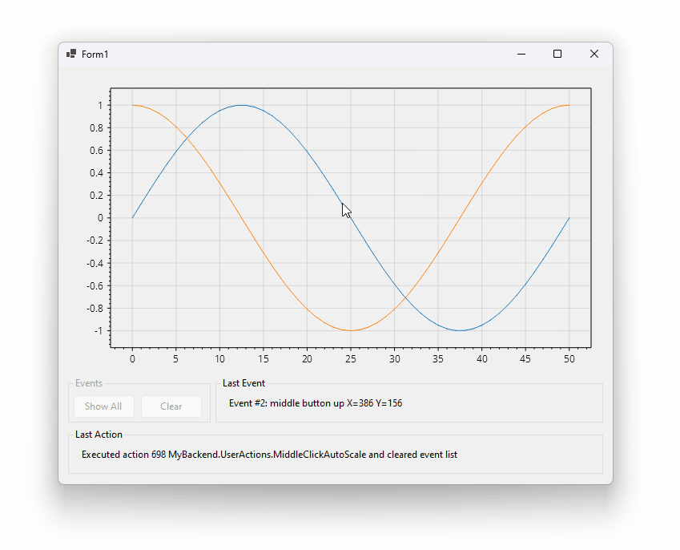

# GUI Command Pattern

An example C# .NET app to experiment with user input abstraction architecture

## Project Structure
* **`MyBackend` contains business logic.** It should not be aware of GUI objects. We can create classes and interfaces in this project.

* **`MyGui` contains GUI logic.** It depends on the backend project. `Form1.cs` is where the main GUI code lives. Ideally the GUI project will be a thin wrapper around functionality that lives in the backend project.

* **`MyBackendTests` contains unit tests.** It depends on the backend project. It uses NUnit which has a similar API to JUnit.

## Development Environment Setup

* Install [Visual Studio Community](https://visualstudio.microsoft.com/vs/community/) (it's free)
* Download this repository and open `src/MySolution.sln` in Visual Studio
* In the Solution Explorer panel, right-click the `MyGui` project and select `Set As Startup Project`
* Press F5 to run the GUI app
* Click the `Test` menu and select `Run All Tests` to run the test suite

## Download
* Source code: Click the green "code" button at the top
* EXE for Windows: https://swharden.com/tmp/gui/